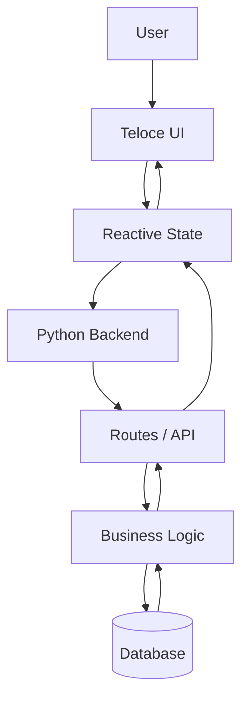
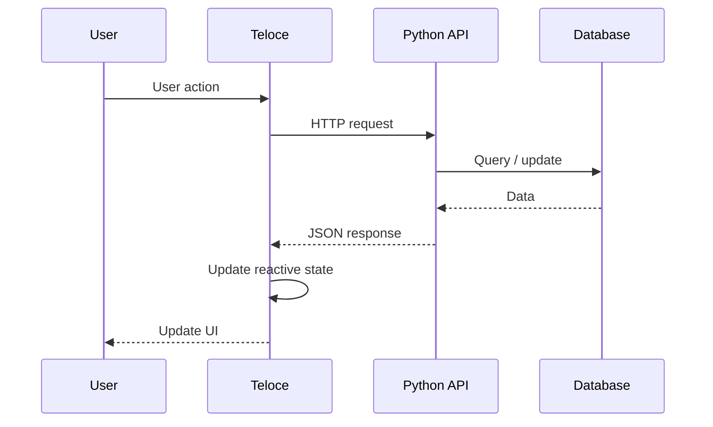
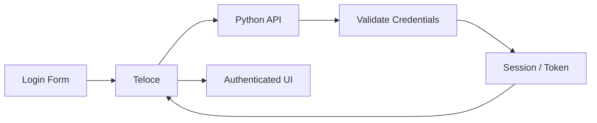
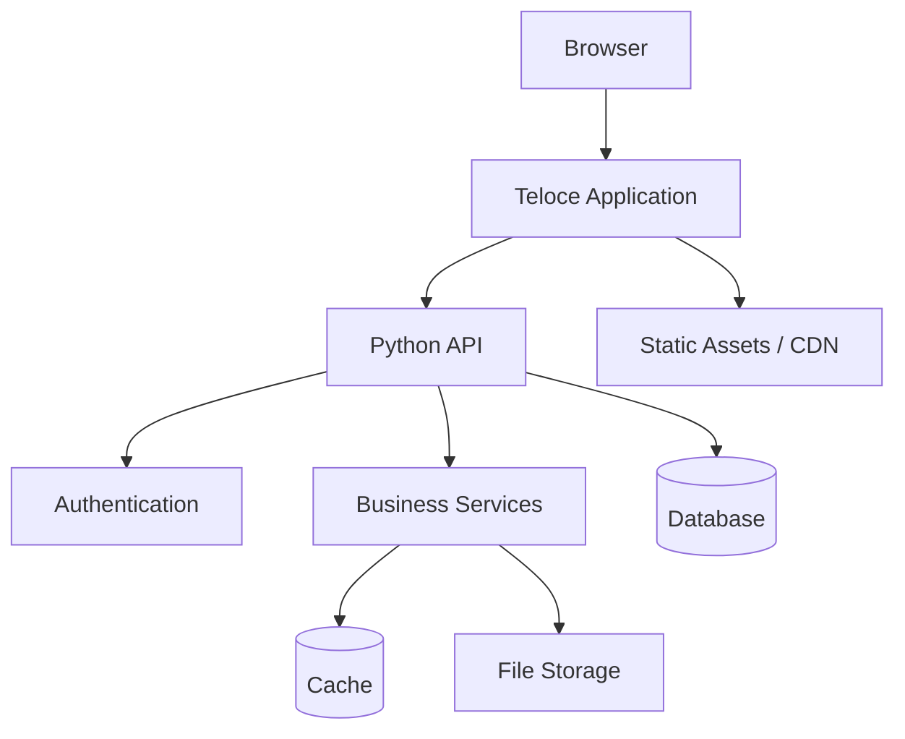

# Python Guide

Use Teloce with Python web frameworks to build reactive, component-based applications while keeping your backend architecture in Python.

> **Teloce handles the frontend. Python handles the backend.**
>
> Build interactive applications without replacing the framework, database, or server architecture you already use.

---

## Architecture

Teloce can sit on top of Flask, Django, FastAPI, or Flaxon.



A typical application separates responsibilities:

| Layer             | Responsibility                               |
| ----------------- | -------------------------------------------- |
| **Teloce**        | UI, components, events, reactivity           |
| **Python**        | Routes, APIs, authentication, business logic |
| **Database**      | Persistent application data                  |
| **Static Assets** | Compiled JavaScript, CSS, images             |

---

## Flask

Flask is a good choice for small and medium-sized applications, APIs, dashboards, and custom services.

### Installation

```bash
pip install flask
npm install teloce
```

### Backend

```python
from flask import Flask, render_template

app = Flask(__name__)

@app.route("/")
def home():
    return render_template(
        "index.html",
        user={"name": "John"},
        products=[
            {"id": 1, "name": "Laptop", "price": 899},
            {"id": 2, "name": "Keyboard", "price": 99},
        ],
    )

if __name__ == "__main__":
    app.run(debug=True)
```

### Teloce Template

```html
<!DOCTYPE html>
<html>
<head>
    <title>Flask + Teloce</title>
    <script src="https://cdn.jsdelivr.net/npm/teloce@0.3.0/dist/teloce.global.min.js"></script>
</head>

<body>
    <div id="app">
        <h1>Hello {{ user.name }}</h1>

        <for key="id" item="product" in="products">
            <article>
                <h3>{{ product.name }}</h3>
                <p>${{ product.price }}</p>

                <button @click="addToCart(product)">
                    Add to Cart
                </button>
            </article>
        </for>

        <p>Cart items: {{ cart.length }}</p>
    </div>

    <script>
        teloce.createApp("#app", {
            user: {{ user|tojson }},
            products: {{ products|tojson }},
            cart: [],

            addToCart(product) {
                this.cart.push(product);
            }
        });
    </script>
</body>
</html>
```

<details>
<summary><strong>When should I use Flask?</strong></summary>

Flask works well when you want maximum control over your backend structure.

Typical applications include:

* REST APIs
* Admin dashboards
* E-commerce applications
* Internal tools
* SaaS applications
* Authentication services
* Small to medium web applications

</details>

---

## Django

Django is useful for larger applications that need an ORM, authentication, administration, middleware, and a structured backend.

### Installation

```bash
pip install django
npm install teloce
```

### View

```python
from django.shortcuts import render

def dashboard(request):
    return render(request, "dashboard.html", {
        "user": {
            "name": "John"
        },
        "stats": {
            "users": 1240,
            "orders": 384,
            "revenue": 24500
        }
    })
```

### Teloce Frontend

```html
<script src="https://cdn.jsdelivr.net/npm/teloce@0.3.0/dist/teloce.global.min.js"></script>

<div id="app">
    <h1>Dashboard</h1>

    <div>
        <strong>{{ stats.users }}</strong>
        <span>Users</span>
    </div>

    <div>
        <strong>{{ stats.orders }}</strong>
        <span>Orders</span>
    </div>

    <div>
        <strong>${{ stats.revenue }}</strong>
        <span>Revenue</span>
    </div>
</div>

<script>
    teloce.createApp("#app", {
        user: {{ user|tojson }},
        stats: {{ stats|tojson }}
    });
</script>
```

---

## FastAPI

FastAPI works especially well when Teloce communicates with a backend through APIs.

### Installation

```bash
pip install fastapi uvicorn
npm install teloce
```

### API

```python
from fastapi import FastAPI

app = FastAPI()

@app.get("/api/products")
async def products():
    return [
        {"id": 1, "name": "Laptop", "price": 899},
        {"id": 2, "name": "Keyboard", "price": 99},
    ]
```

### Teloce

```javascript
const app = teloce.createApp("#app", {
    products: [],
    loading: false,

    async loadProducts() {
        this.loading = true;

        const response = await fetch("/api/products");
        this.products = await response.json();

        this.loading = false;
    }
});
```

---

# Building Complex Applications

For production applications, avoid putting everything inside one template.

A larger application can be organized like this:

```text
my-app/
│
├── backend/
│   ├── app.py
│   │
│   ├── routes/
│   │   ├── auth.py
│   │   ├── users.py
│   │   ├── products.py
│   │   └── payments.py
│   │
│   ├── services/
│   │   ├── auth.py
│   │   ├── payments.py
│   │   └── email.py
│   │
│   └── models/
│       ├── user.py
│       └── product.py
│
├── frontend/
│   ├── components/
│   │   ├── Navbar.vel
│   │   ├── Modal.vel
│   │   ├── ProductCard.vel
│   │   └── DataTable.vel
│   │
│   ├── pages/
│   │   ├── Home.vel
│   │   ├── Dashboard.vel
│   │   └── Settings.vel
│   │
│   ├── services/
│   │   └── api.js
│   │
│   └── app.vel
│
└── static/
```

This gives each part of the application a clear responsibility.

---

# API-Driven Applications

A common architecture is:



Example:

```javascript
const app = teloce.createApp("#app", {
    users: [],
    loading: false,
    error: null,

    async loadUsers() {
        this.loading = true;
        this.error = null;

        try {
            const response = await fetch("/api/users");

            if (!response.ok) {
                throw new Error("Failed to load users");
            }

            this.users = await response.json();

        } catch (error) {
            this.error = error.message;

        } finally {
            this.loading = false;
        }
    }
});
```

Template:

```html
<div id="app">

    <p :show="loading">
        Loading users...
    </p>

    <p :show="error">
        {{ error }}
    </p>

    <for key="id" item="user" in="users">
        <article>
            <h3>{{ user.name }}</h3>
            <p>{{ user.email }}</p>
        </article>
    </for>

</div>
```

---

# Authentication

Keep authentication and authorization on the Python backend.



Teloce can manage the UI state:

```javascript
const app = teloce.createApp("#app", {
    user: null,
    authenticated: false,

    async loadUser() {
        const response = await fetch("/api/me");

        if (response.ok) {
            this.user = await response.json();
            this.authenticated = true;
        }
    },

    async logout() {
        await fetch("/api/logout", {
            method: "POST"
        });

        this.user = null;
        this.authenticated = false;
    }
});
```

For production applications, let the backend remain responsible for:

* Authentication
* Authorization
* Sessions
* Password handling
* Permissions
* Token validation

---

# Forms

Teloce can handle interactive forms while Python handles validation and persistence.

```html
<form @submit.prevent="submit">

    <input
        type="email"
        :model="form.email"
        placeholder="Email"
    />

    <input
        type="password"
        :model="form.password"
        placeholder="Password"
    />

    <p :show="error">
        {{ error }}
    </p>

    <button :disabled="loading">
        {{ loading ? "Signing in..." : "Sign in" }}
    </button>

</form>
```

```javascript
const app = teloce.createApp("#app", {

    form: {
        email: "",
        password: ""
    },

    loading: false,
    error: null,

    async submit() {
        this.loading = true;
        this.error = null;

        try {
            const response = await fetch("/api/login", {
                method: "POST",
                headers: {
                    "Content-Type": "application/json"
                },
                body: JSON.stringify(this.form)
            });

            if (!response.ok) {
                throw new Error("Invalid credentials");
            }

        } catch (error) {
            this.error = error.message;

        } finally {
            this.loading = false;
        }
    }

});
```

---

# Reusable Components

Large applications should use reusable components instead of repeating UI logic.

Common components include:

```text
Navbar
Sidebar
Modal
Button
Input
Table
Pagination
ProductCard
UserCard
Notification
LoadingSpinner
```

Example:

```javascript
const ProductCard = teloce.defineComponent({

    props: {
        product: {
            type: Object,
            required: true
        }
    },

    template: `
        <article>
            <h3>{{ product.name }}</h3>
            <p>$ {{ product.price }}</p>

            <button @click="$emit('add', product)">
                Add to Cart
            </button>
        </article>
    `
});
```

The component can then be reused throughout the application.

---

# Reactive Application State

Use Teloce reactivity for state that needs to update the interface.

```javascript
const [user, setUser] = createSignal(null);
const [theme, setTheme] = createSignal("dark");
const [cart, setCart] = createSignal([]);
```

Use local component state for UI-specific information and shared state only when multiple parts of the application need it.

---

# Single File Components

For larger projects, use `.vel` files.

```text
frontend/
└── components/
    └── ProductCard.vel
```

```html
<template>
    <article class="product-card">
        <h2>{{ product.name }}</h2>

        <p>${{ product.price }}</p>

        <button @click="add">
            Add to Cart
        </button>
    </article>
</template>

<script>
export default {
    props: {
        product: {
            type: Object,
            required: true
        }
    },

    methods: {
        add() {
            this.$emit("add", this.product);
        }
    }
};
</script>

<style scoped>
.product-card {
    padding: 20px;
    border-radius: 14px;
    border: 1px solid #334155;
}

.product-card:hover {
    transform: translateY(-3px);
}
</style>
```

Build `.vel` components with:

```bash
teloce build
```

---

# Production Architecture

A complete application can look like:



This architecture works well for applications such as:

* SaaS platforms
* E-commerce
* Admin dashboards
* Learning platforms
* Booking systems
* Customer portals
* Analytics applications
* Internal business tools
* API-driven applications

---

# Development Workflow

Install dependencies:

```bash
npm install
```

Start the Teloce development server:

```bash
teloce dev
```

Run the Python backend:

```bash
python app.py
```

Or proxy Teloce through a Python development server:

```bash
teloce dev --proxy http://localhost:5000
```

Build production assets:

```bash
teloce build
```

---

# Production Checklist

Before deploying a Teloce + Python application:

* [ ] Build production frontend assets
* [ ] Disable development/debug mode
* [ ] Configure authentication securely
* [ ] Validate API input on the backend
* [ ] Use HTTPS
* [ ] Configure database connections
* [ ] Configure static file serving
* [ ] Add error handling
* [ ] Add logging
* [ ] Use environment variables for secrets
* [ ] Test production builds

---

## Framework Comparison

| Framework   | Best For                       |
| ----------- | ------------------------------ |
| **Flask**   | Flexible applications and APIs |
| **Django**  | Full-featured web applications |
| **FastAPI** | API-first applications         |
| **Flaxon**  | Async Python applications      |

---

## Quick Reference

| Task                 | Teloce | Python |
| -------------------- | ------ | ------ |
| UI                   | ✅      |        |
| Components           | ✅      |        |
| Reactivity           | ✅      |        |
| DOM updates          | ✅      |        |
| Events               | ✅      |        |
| API                  |        | ✅      |
| Authentication       |        | ✅      |
| Database             |        | ✅      |
| Business logic       |        | ✅      |
| Server-side services |        | ✅      |

---

## Next Steps

* [Templates](https://docs/guides/templates) — Learn template syntax
* [Reactivity](https://docs/guides/reactivity) — Signals and reactive updates
* [Components](https://docs/guides/components) — Build reusable components
* [Directives](https://docs/guides/directives) — Add behavior to templates
* [SFC (.vel)](https://docs/guides/sfc) — Build Single File Components
* [Cheatsheet](https://docs/guides/cheatsheet) — Quick API reference
* [Examples](https://docs/examples) — Explore complete applications
